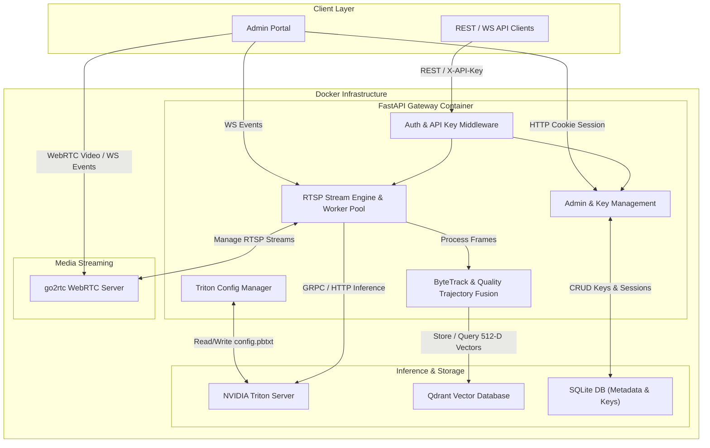

# Kiến Trúc Hệ Thống (System Architecture Reference)

Tài liệu này mô tả chi tiết kiến trúc tổng quan, luồng xử lý dữ liệu, thiết kế backend FastAPI, cơ chế quản lý mô hình Triton, giải thuật Re-ID fusion, và schema dữ liệu trong dự án **Triton API**.

---

## 1. Tổng Quan Kiến Trúc (High-Level Architecture)

Hệ thống được thiết kế theo kiến trúc Microservices & Event-Driven Streaming Containerized Stack, chạy trên Docker Compose.



---

## 2. Các Thành Phần Backend Cốt Lõi (Core Components)

### 2.1. FastAPI API Server (`main.py`)
- Quản lý các endpoint REST API, WebSocket streams cho client.
- Xử lý tạo luồng, hủy luồng, Multi-Session Stream Isolation.
- Đóng vai trò làm Controller điều phối giữa Triton Client, ByteTrack, Qdrant DB và go2rtc Server.

### 2.2. Triton Config Manager (`config_manager.py`)
- Đọc, phân tích (parse) và ghi lại file `config.pbtxt` của Triton Inference Server bằng Regex Parser an toàn.
- Hỗ trợ cập nhật tham số `max_batch_size`, `dynamic_batching`, `instance_group` (GPU/CPU selection), và `input`/`output` dimensions.
- Xử lý việc loại bỏ hoặc bổ sung chiều batch (stripping/adding `-1` batch dimension) khi chuyển đổi giữa `max_batch_size: 0` và `max_batch_size > 0`.

### 2.3. Model Renaming Engine (`main.py` & `admin.js`)
- Cho phép đổi tên mô hình trực tiếp trong hệ thống mà không gây lỗi đứt gãy cấu hình:
  1. Hủy các luồng inference đang chạy mô hình cũ.
  2. Đổi tên thư mục mô hình trong `models/<model_name>`.
  3. Cập nhật trường `name: "<new_name>"` trong file `models/<new_name>/config.pbtxt`.
  4. Cập nhật file `model_meta.json`.
  5. Gọi Triton Unload `<old_name>` & Load `<new_name>`.

### 2.4. Tracking & Motion Trajectory (`tracker.py`)
- **ByteTrack**: Định danh và theo vết đối tượng liên tục qua từng khung hình.
- **Re-ID Fusion**: Trích xuất vector 512 chiều bằng **TransReID-SSL (ViT-S/16)** để nhận diện lại đối tượng cross-camera.
- **Xử lý quỹ đạo (Trajectory)**:
  - Chuẩn hóa tọa độ theo tỉ lệ `[0.0..1.0]` độc lập với độ phân giải video.
  - Định vị theo trọng tâm đối tượng và lưu chuỗi `bbox_trail` theo thời gian cho hiển thị lộ trình trên Canvas.

---

## 3. Cơ Sở Dữ Liệu & Payload Schemas

### 3.1. CSDL SQLite (`database.py` & `auth.py`)
Lưu trữ thông tin quản trị và xác thực trong `/app/data/auth.db`:
- **`api_keys` Table**:
  - `id` (INTEGER PRIMARY KEY AUTOINCREMENT)
  - `key_name` (TEXT NOT NULL)
  - `key_hash` (TEXT UNIQUE NOT NULL, SHA-256)
  - `prefix` (TEXT NOT NULL, e.g. `tr_live_a1b2c3d4`)
  - `scopes` (TEXT NOT NULL)
  - `allowed_models` (TEXT NOT NULL)
  - `created_at` (TIMESTAMP DEFAULT CURRENT_TIMESTAMP)
  - `expires_at` (TIMESTAMP)
  - `is_active` (INTEGER DEFAULT 1)
  - `created_by` (TEXT REFERENCES admin_accounts)
  - `raw_key` (TEXT)
  - `last_used_at` (INTEGER)
  - `usage_count` (INTEGER DEFAULT 0)

- **`admin_accounts` Table**:
  - `id` (INTEGER PRIMARY KEY AUTOINCREMENT)
  - `username` (TEXT UNIQUE NOT NULL)
  - `password_hash` (TEXT NOT NULL)
  - `role` (TEXT DEFAULT 'admin')
  - `created_at` (TIMESTAMP DEFAULT CURRENT_TIMESTAMP)

- **`admin_sessions` Table**:
  - `session_id` (TEXT PRIMARY KEY)
  - `username` (TEXT NOT NULL)
  - `created_at` (TIMESTAMP DEFAULT CURRENT_TIMESTAMP)
  - `expires_at` (TIMESTAMP NOT NULL)

### 3.2. Qdrant Payload Structure (`database.py`)
```json
{
  "global_id": "PER-5C07E8",
  "class_name": "person",
  "camera_id": "ws_stream_1",
  "camera_name": "Front Gate Camera",
  "client_ip": "192.168.1.50",
  "timestamp": "2026-08-05T22:20:27.123456",
  "bbox": [0.35, 0.22, 0.55, 0.78],
  "bbox_trail": [
    [0.35, 0.22, 0.55, 0.78],
    [0.37, 0.25, 0.56, 0.80]
  ],
  "image_path": "/events_images/crop_PER-5C07E8_1721832000.jpg",
  "image_path_full": "/events_images/full_PER-5C07E8_1721832000.jpg",
  "video_filename": "stream_1_20260805.mp4",
  "video_offset_seconds": 142.5,
  "track_session_id": "session_8f3b2a1c"
}
```

---

## 4. Quy Trình Bảo Mật & Xác Thực (Security Architecture)

1. **Xác Thực Admin**:
   - Sử dụng Session Cookie `admin_session` có cờ `HttpOnly` và `SameSite=Lax`.
   - Session ID là chuỗi ngẫu nhiên an toàn mã hóa 32-byte (`secrets.token_hex(32)`) kèm thời hạn hết hạn 24 giờ, lưu trong bảng `admin_sessions` của SQLite.

2. **Xác Thực API Key**:
   - Header `X-API-Key` nhận khóa secret dạng `tr_live_<32_random_bytes>`.
   - Hệ thống chỉ băm SHA-256 để so sánh với `key_hash` trong CSDL, không bao giờ lưu trữ khóa gốc dạng thô (plaintext).

3. **Cơ Chế Khôi Phục Lỗi (Fault Tolerance & Isolation)**:
   - Các luồng RTSP chạy trong các asyncio Task riêng biệt. Lỗi mạng camera 1 không làm ảnh hưởng đến camera 2.
   - Khi Triton restart hoặc reload mô hình, API Gateway tự động retry kết nối gRPC sau 2 giây.
