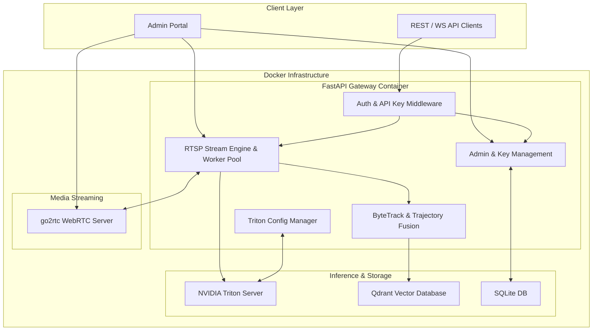

# Triton API: Real-Time Multi-Model AI Vision & Cross-Camera Re-ID Platform

[](https://www.python.org/)
[](https://fastapi.tiangolo.com/)
[](https://developer.nvidia.com/nvidia-triton-inference-server)
[](https://qdrant.tech/)
[](https://www.docker.com/)

**Triton API** là hệ thống phân tích video AI thời gian thực đa mô hình (Real-Time Multi-Model AI Video Analytics Platform), được tối ưu hóa cho hạ tầng GPU NVIDIA. Hệ thống phục vụ các bài toán NVR giám sát an ninh thông minh, quản lý mô hình Triton linh hoạt, theo vết đối tượng đa camera (Cross-Camera Re-ID), và quản trị truy cập doanh nghiệp.

---

## 1. Tính Năng Cốt Lõi (Key Features)

### 1.1. Quản Lý Suy Luận AI Đa Mô Hình (Multi-Model Triton Server)
- Tích hợp **NVIDIA Triton Inference Server (GRPC/HTTP)** với cơ chế quản lý mô hình linh hoạt (*Explicit Model Control Mode*).
- Hỗ trợ đổi tên mô hình trực tiếp (in-place model renaming), hot-reloading mô hình, tự động cập nhật cấu hình `config.pbtxt` và điều chỉnh dynamic batching.
- Hỗ trợ phát hiện đối tượng thời gian thực **YOLOv8** (Object Detection) và **YOLOE / Open-Vocabulary Prompting** (Nhận diện vật thể theo từ khóa tùy chỉnh).
- Tích hợp mô hình trích xuất đặc trưng **TransReID-SSL (ViT-S/16)** trích xuất 512-D Embedding vector.
- Chuẩn hóa định dạng kết quả suy luận theo chuẩn **COCO JSON Format** (`bbox: [x, y, w, h]` và `segmentation` RLE mask).

### 1.2. Quản Lý Luồng RTSP & WebRTC Fan-out (go2rtc Integration)
- Khởi tạo và quản lý luồng RTSP động từ nhiều camera IP.
- Tích hợp **go2rtc** cho phép Fan-out 1 kết nối RTSP vật lý thành nhiều luồng xem Live WebRTC siêu thấp độ trễ (<200ms).
- Cơ chế **Multi-Session Stream Isolation**: Tự động cách ly luồng suy luận cho nhiều người dùng cùng kết nối tới 1 URL camera nhưng yêu cầu các mô hình AI hoặc tham số nhận diện khác nhau.

### 1.3. Tìm Kiếm Đối Tượng Chéo Camera (Cross-Camera Photo Re-ID Search)
- Sử dụng **Qdrant Vector Database** với chỉ mục HNSW và khoảng cách Cosine Similarity.
- Tự động trích xuất vector đối tượng ổn định vết (**Quality-Weighted Trajectory Fusion**) và truy vấn tức thì (<10ms).
- Tìm kiếm vật thể theo ảnh upload, hiển thị danh sách đối tượng trùng khớp kèm điểm số phần trăm và lộ trình di chuyển (Space-Time Trajectory Map).

### 1.4. Quản Trị Hệ Thống & Bảo Mật Chuẩn Doanh Nghiệp
- Bảng điều khiển Quản trị Web Admin Portal (`/admin/`).
- Quản lý API Key doanh nghiệp (khởi tạo secret prefix `tr_live_`, băm SHA-256, gia hạn, phân quyền scopes và thu hồi).
- Giám sát tài nguyên Container (CPU, RAM, GPU, Memory Limit) real-time thông qua Docker Engine Socket.

---

## 2. Kiến Trúc Tổng Quan (System Architecture)



---

## 3. Tài Liệu Hướng Dẫn & Tham Chiếu (Documentation)

- **[USAGE.md](USAGE.md)**: Hướng dẫn cài đặt chi tiết, triển khai Docker Compose, cấu hình biến môi trường, sử dụng Web Admin Portal và tài liệu API.
- **[ARCHITECTURE.md](ARCHITECTURE.md)**: Tài liệu kiến trúc chuyên sâu, sơ đồ luồng dữ liệu, chi tiết module backend, Triton client integration, quy trình Re-ID fusion, và schema CSDL.

---

## 4. Hướng Dẫn Nhanh (Quick Start)

### 4.1. Yêu Cầu Yếu Tố Hạ Tầng
- **OS**: Linux (Ubuntu 22.04 LTS / 24.04 LTS).
- **GPU**: NVIDIA GPU (GTX 1060 6GB trở lên) với Driver 535+.
- **Software**: Docker 24.0+, Docker Compose v2.20+, NVIDIA Container Toolkit (`nvidia-ctk`).

### 4.2. Khởi Động Triển Khai
```bash
# 1. Clone repository
git clone https://github.com/lamle1/triton-api.git
cd triton-api

# 2. Cấu hình biến môi trường
cp .env.example .env

# 3. Khởi chạy hệ thống bằng Docker Compose
docker compose -f docker-compose.example.yaml up -d
```

Sau khi khởi chạy thành công, truy cập:
- **Web Admin Portal (Unified NVR & Management)**: `http://localhost:8003/admin/`
- **Swagger Interactive API Documentation**: `http://localhost:8003/docs`
- **ReDoc API Documentation**: `http://localhost:8003/redoc`

Để xem tài liệu triển khai và vận hành chi tiết hơn, vui lòng tham khảo **[USAGE.md](USAGE.md)**.

---

## 5. Biến Môi Trường (Environment Variables Guide)

Hệ thống cấu hình thông qua file `.env`. Bạn có thể sao chép từ `.env.example` và tùy chỉnh theo nhu cầu hạ tầng:

| Biến Môi Trường (Variable) | Giá Trị Mặc Định (Default) | Mô Tả Chi Tiết (Description) |
|---|---|---|
| `ADMIN_PASSWORD` | `admin123` | Mật khẩu truy cập Bảng điều khiển Web Admin (`/admin/`). |
| `REQUIRE_API_KEY` | `true` | Yêu cầu Header `X-API-Key` cho các REST API suy luận (`true`/`false`). |
| `API_PORT` | `8003` | Cổng HTTP công khai của API Gateway Backend. |
| `TRITON_GRPC_URL` | `triton-remote:8001` | Địa chỉ kết nối gRPC tới Triton Inference Server. |
| `TRITON_HTTP_URL` | `http://triton-remote:8000` | Địa chỉ kết nối HTTP/REST tới Triton Inference Server. |
| `TRITON_METRICS_URL` | `http://triton-remote:8002/metrics` | Địa chỉ giám sát Prometheus Metrics của Triton. |
| `GO2RTC_API_URL` | `http://go2rtc:1984` | Địa chỉ API nội bộ kết nối tới go2rtc WebRTC server. |
| `GO2RTC_PUBLIC_URL` | `http://localhost:1984` | URL công khai của go2rtc cho WebRTC Player trên trình duyệt client. |
| `CORS_ORIGINS` | `*` | Danh sách tên miền cho phép truy cập Cross-Origin (`*` cho phép tất cả). |
| `YOLOE_WEIGHTS` | `/weights/yoloe-v8s-seg.pt` | Đường dẫn file trọng số cho mô hình YOLOE Open-Vocabulary. |
| `RTSP_GSTREAMER_DECODER` | `nvh264dec` | Plugin giải mã video phần cứng H.264 trên GPU NVIDIA (`nvh264dec`/`avdec_h264`). |
| `RTSP_GSTREAMER_LATENCY` | `200` | Dung lượng Jitter Buffer (ms) chống giật khung hình khi stream RTSP. |
| `UVICORN_WORKERS` | `1` | Số lượng tiến trình worker Uvicorn xử lý request. |
| `MAX_CONCURRENT` | `32` | Số lượng luồng suy luận đồng thời tối đa trong Semaphore pool. |

---

## 6. Chi Tiết Các Mô Hình Đã Tích Hợp Sẵn (Built-in Core AI Models)

Hệ thống được đóng gói sẵn 2 mô hình AI cốt lõi cho tác vụ Re-ID Tracking và Open-Vocabulary Detection:

| Mô Hình (Model) | Vị Trí File (Path) | Kích Thước (Size) | Mô Tả & Vai Trò Trong Hệ Thống |
|---|---|---|---|
| **TransReID-SSL (Re-ID Feature Extractor)** | `models/osnet/1/model.onnx` | ~85 MB | Mô hình Vision Transformer (ViT-S/16) trích xuất 512-dim embedding vector đối tượng (huấn luyện tự giám sát trên LUPerson + fine-tune MSMT17 bởi Alibaba DAMO Academy). Phục vụ định danh & theo vết chéo camera với Qdrant Vector DB.<br>• *Script xuất ONNX*: [`scripts/export_osnet.py`](scripts/export_osnet.py) |
| **YOLOE Prompt Segmenter** | `weights/yoloe-v8s-seg.pt`<br>`weights/mobileclip_blt.ts` | 31 MB<br>571 MB | Bộ mô hình phát hiện đối tượng theo từ khóa tùy chỉnh (Open-Vocabulary Zero-Shot Detection). Cho phép nhận diện theo prompt văn bản (ví dụ: `"helmet, fire, smoke"`).<br>• *Cơ chế nướng sẵn*: Đã tích hợp sẵn trong Docker Image `ghcr.io/lamle1/triton-api:latest`, tự động khôi phục vào `/weights/` khi `docker compose up`. |

---

## 7. Hướng Dẫn Docker Compose (Docker Compose Guide)

Repository cung cấp 2 cấu hình Docker Compose đáp ứng các kịch bản triển khai khác nhau:

### 7.1. File Cấu Hình Triển Khai

| File Docker Compose | Kịch Bản Sử Dụng (Use Case) | Mô Tả |
|---|---|---|
| **`docker-compose.example.yaml`** | Pre-built Image Deployment | Sử dụng container image đã đóng gói sẵn (`ghcr.io/lamle1/triton-api:latest`), không cần build mã nguồn local. |
| **`docker-compose.build.example.yaml`** | Local Build Deployment | Tự build lại container image API Server từ mã nguồn local `./api/Dockerfile`. |

### 7.2. Các Lệnh Vận Hành Thông Dụng

- **Khởi chạy hệ thống ở chế độ ngầm (Background mode)**:
  ```bash
  docker compose -f docker-compose.example.yaml up -d
  ```

- **Khởi chạy tự build lại image từ source**:
  ```bash
  docker compose -f docker-compose.build.example.yaml up -d
  ```

- **Xem log thời gian thực của toàn bộ stack**:
  ```bash
  docker compose logs -f
  ```

- **Xem log riêng của container API Gateway**:
  ```bash
  docker compose logs -f api
  ```

- **Kiểm tra trạng thái các container**:
  ```bash
  docker compose ps
  ```

- **Dừng và xóa toàn bộ container stack**:
  ```bash
  docker compose down
  ```

---

## 8. Cấu Trúc Thư Mục Dự Án (Repository Structure)

```
triton-api/
├── api/                        # FastAPI Gateway Engine & Admin Panel
│   ├── admin/                  # Web Admin Control Panel UI
│   ├── auth.py                 # Authenticator & API Key Middleware
│   ├── config_manager.py       # Triton config.pbtxt parser & serializer
│   ├── database.py             # SQLite database management
│   ├── main.py                 # API routes & Stream Engine Worker
│   ├── reid_client.py          # Qdrant Vector DB & ReID client
│   ├── tracker.py              # ByteTrack & Trajectory Fusion logic
│   ├── triton_client.py        # Triton GRPC/HTTP client interface
│   └── Dockerfile              # API Server Docker Buildfile
├── config/
│   └── go2rtc/                 # go2rtc WebRTC Server configuration
├── models/                     # Triton Model Repository (config.pbtxt & osnet model.onnx)
├── scripts/                    # Developer & Model Exporter Utilities
│   └── export_osnet.py         # Script xuất mô hình ONNX TransReID/OSNet 512-D cho Triton
├── weights/                    # Model weights (.onnx, .engine, .pt)
├── docker-compose.yaml         # Production Docker Compose stack
├── docker-compose.example.yaml # Pre-built image Compose example
├── docker-compose.build.example.yaml # Local build Compose example
├── .env.example                # Environment variables template
├── README.md                   # Project Overview & Quick Start
├── USAGE.md                    # Deployment, Operations & User Guide
└── ARCHITECTURE.md             # In-depth System Architecture Reference
```

---

## 9. Tham Chiếu & Tài Liệu Nguồn (References & Documentation)

Danh sách tài liệu tham khảo và thư viện mở được sử dụng trong dự án:

1. **NVIDIA Triton Inference Server**
   - Máy chủ suy luận mô hình AI (gRPC/HTTP API, dynamic batching, explicit model control).
   - [Tài liệu Triton](https://developer.nvidia.com/nvidia-triton-inference-server) | [GitHub Repository](https://github.com/triton-inference-server/server)

2. **Ultralytics YOLO (YOLOv8 & YOLOE)**
   - Mô hình phát hiện đối tượng thời gian thực (Object Detection, Segmentation & Open-Vocabulary Prompting).
   - [Tài liệu Ultralytics](https://docs.ultralytics.com/) | [GitHub Repository](https://github.com/ultralytics/ultralytics)

3. **TransReID-SSL (Transformer-Based Person Re-ID)**
   - Mô hình trích xuất đặc trưng Vision Transformer (ViT-S/16) 512-D embedding vectors cho bài toán định danh và tìm kiếm đối tượng chéo camera.
   - *Tác giả & Repository*: Alibaba DAMO Academy – [Mã nguồn: damo-cv/TransReID-SSL](https://github.com/damo-cv/TransReID-SSL)

4. **ByteTrack (Multi-Object Tracking)**
   - Thuật toán theo vết đa đối tượng (MOT) sử dụng Kalman Filter và ghép nối 2 giai đoạn (2-stage IoU association).
   - *Tác giả*: Zhang et al. (ECCV 2022) – [Mã nguồn: ifzhang/ByteTrack](https://github.com/ifzhang/ByteTrack)

5. **Apple MobileCLIP**
   - Mô hình mã hóa văn bản và hình ảnh Open-Vocabulary cho tính năng YOLOE text prompt encoding.
   - [GitHub Repository](https://github.com/apple/ml-mobileclip)

6. **Qdrant Vector Database**
   - Cơ sở dữ liệu vector dùng cho lưu trữ chỉ mục HNSW và truy vấn độ tương đồng Cosine (Cosine Similarity) các vector Re-ID.
   - [Tài liệu Qdrant](https://qdrant.tech/documentation/) | [GitHub Repository](https://github.com/qdrant/qdrant)

7. **go2rtc**
   - Máy chủ phân phối và xem trực tiếp luồng camera IP (RTSP, WebRTC, MSE).
   - [GitHub Repository](https://github.com/AlexxIT/go2rtc)

8. **FastAPI, PyTorch & ONNX Runtime**
   - Framework REST API và thư viện suy luận mô hình phía backend gateway.
   - [Tài liệu FastAPI](https://fastapi.tiangolo.com/) | [Tài liệu PyTorch](https://pytorch.org/) | [Tài liệu ONNX Runtime](https://onnxruntime.ai/)

9. **MS COCO Format & pycocotools**
   - Chuẩn cấu trúc định dạng dữ liệu đầu ra phát hiện đối tượng (`bbox: [x, y, w, h]`, `area`, `category_id`, `category_name`) và mã hóa mặt nạ phân đoạn Run-Length Encoding (RLE).
   - [Trang chủ MS COCO](https://cocodataset.org/) | [Mã nguồn pycocotools](https://github.com/cocodataset/cocoapi)


